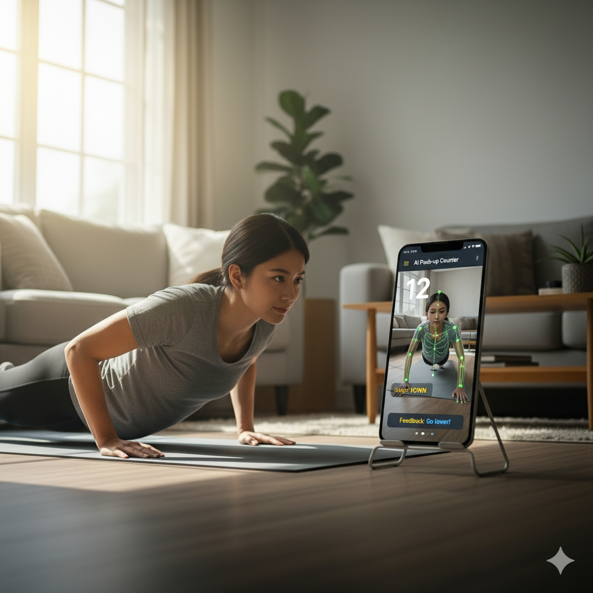

# 💪 Push-up Counter ✨

WebカメラとAIによる姿勢推定技術を利用して、腕立て伏せの回数をリアルタイムで自動カウントするWebアプリケーションです。  
ジムに行かなくても、自宅で手軽に正確なトレーニング記録がつけられます。

  

ここから開始できます⇒https://imshota1009.github.io/Push-up-counter/

---

    

## ✨ 特徴 (Features)

- **AIによる自動カウント**  
  TensorFlow.js (MoveNet) を利用して体の関節を認識し、肘の角度から腕立て伏せの動作を判定します。

- **リアルタイムフィードバック**  
  現在の回数、腕の状態（UP/DOWN）、簡単なフィードバックを画面に表示します。

- **インストール不要**  
  Webブラウザだけで動作。ソフトウェアのインストールは不要です。

- **プライバシー配慮**  
  カメラ映像の処理はすべてブラウザ内で完結。外部サーバーには送信されません。

- **レスポンシブデザイン**  
  PC / タブレット / スマートフォン対応。

---

## 🚀 使い方 (How To Use)

1. **ファイルを開く**  
   `pushup_counter.html` をブラウザで開きます。

2. **カメラを許可**  
   ブラウザからのアクセス要求を「許可」してください。

3. **準備**  
   - AIモデルの読み込みが完了するまで少し待ちます。  
   - カメラ映像が表示されたら、体をカメラに対して真横に向けます。  
   - 肩・肘・手首が映るように位置や距離を調整してください。

4. **トレーニング開始**  
   - 腕を曲げ90度以下になった状態（DOWN）から、腕をしっかり伸ばした状態（UP）で **1回** カウントされます。

5. **リセット**  
   - 「リセット」ボタンでカウントを0に戻せます。

---

## 💡 正確にカウントするためのヒント

- 明るい環境で行うと精度が向上します  
- 背景はシンプルにしてください  
- 体のラインが分かりやすい服装を着用してください  
- カメラ位置は体全体＋腕が映るように調整してください

---

## 🛠️ 使用技術 (Tech Stack)

- **HTML / CSS / JavaScript** – 基本構造とロジック  
- **TensorFlow.js** – ブラウザで動作する機械学習ライブラリ  
- **Pose Detection (MoveNet)** – 姿勢推定モデル  
- **Tailwind CSS** – UIスタイリング
